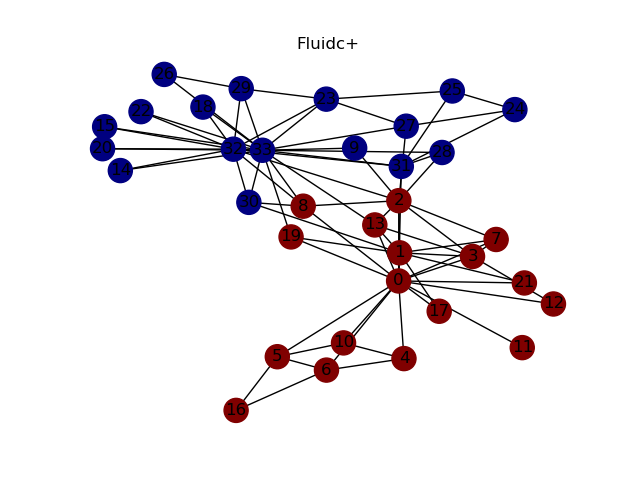
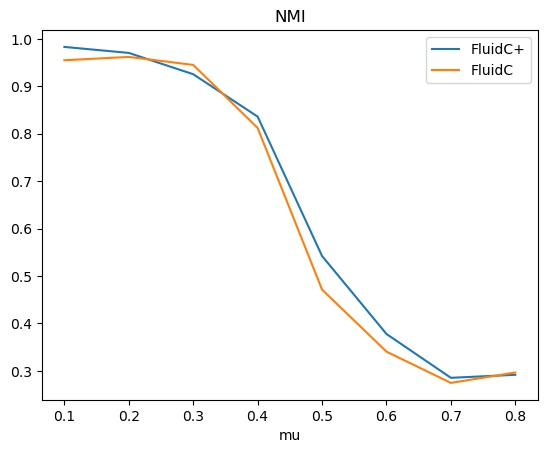
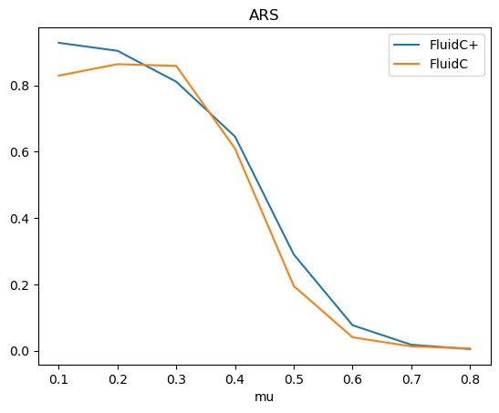
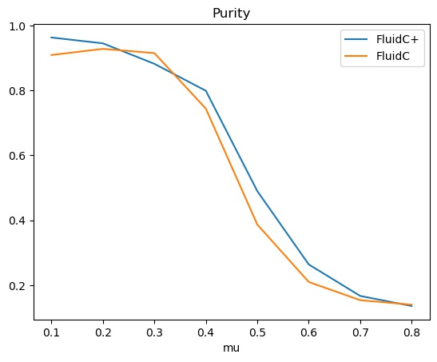
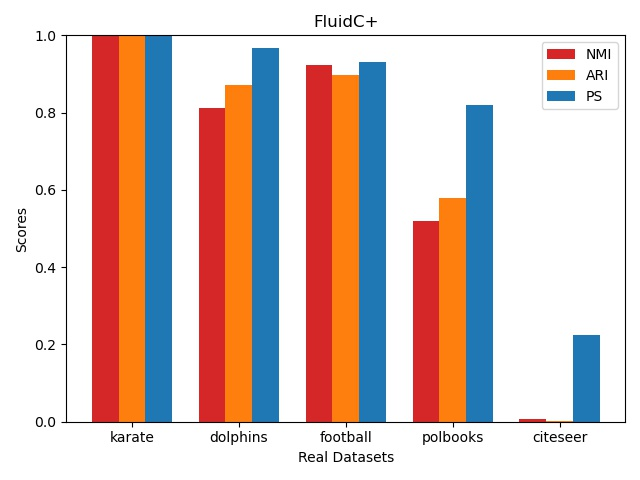

# FluidC and FluidC+

A simple Python implementation of **FluidC+** which is based on the original paper.
If you intend to use this repository for your own project, please cite:

```
@ARTICLE{Sheng2019,
title = {FluidC+: A novel community detection algorithm based on fluid propagation},
author = {Sheng, Jinfang and Wang, Kai and Sun, Zejun and Hu, Jie and Wang, Bin and Ullah, Aman},
year = {2019},
journal = {International Journal of Modern Physics C (IJMPC)},
volume = {30},
number = {04},
pages = {1-17},
url = {https://EconPapers.repec.org/RePEc:wsi:ijmpcx:v:30:y:2019:i:04:n:s0129183119500219}
}
```

This code relies also on the original implementation of **FluidC**:

https://github.com/HPAI-BSC/Fluid-Communities

Therefore, please also cite:

```
@InProceedings{10.1007/978-3-319-72150-7_19,
author="Par{\'e}s, Ferran
and Gasulla, Dario Garcia
and Vilalta, Armand
and Moreno, Jonatan
and Ayguad{\'e}, Eduard
and Labarta, Jes{\'u}s
and Cort{\'e}s, Ulises
and Suzumura, Toyotaro",
editor="Cherifi, Chantal
and Cherifi, Hocine
and Karsai, M{\'a}rton
and Musolesi, Mirco",
title="Fluid Communities: A Competitive, Scalable and Diverse Community Detection Algorithm",
booktitle="Complex Networks {\&} Their Applications VI",
year="2018",
publisher="Springer International Publishing",
address="Cham",
pages="229--240",
}
```

# Dependencies

This project exploits the following python libraries:

- numpy (2.5)
- networkX (1.20.3)
- matplotlib (3.4.2)
- scikit-learn (1.0)
- scipy (1.7.1)

For installing dependencies simply run:

```bash
pip install -r requirements.txt
```

# Usage

Mainly, this project aims to provide a comparison between FluidC+ and FluidC algorithms.
For visualizing community detection results on a real community graph simply run:

```bash
python3 fludic_plus.py --name karate --plot
```



You can discover possible parameters by running:

```bash
python3 fludic_plus.py -h
```

You can also visualize the algorithms performances on synthetic LFR graphs (it could take a while):
```bash
python3 tests.py --synth1 ./synthetic_dataset/dataset1/
```








Or compare both methods on all real datasets:

```bash
python3 tests.py --bar
```



# License
This project is licensed under the GPL v3.0 license. 
See the [LICENSE](LICENSE) file for details.
